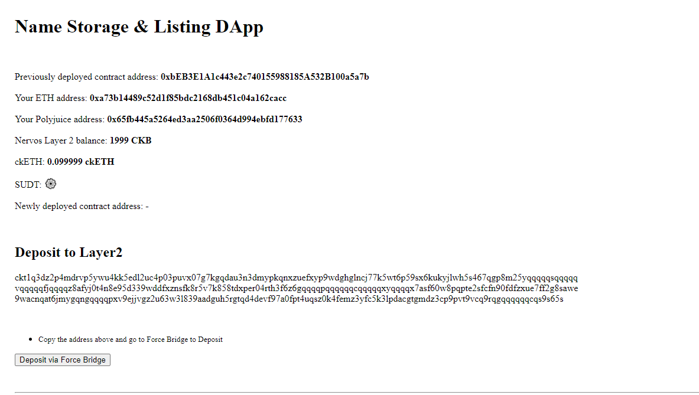
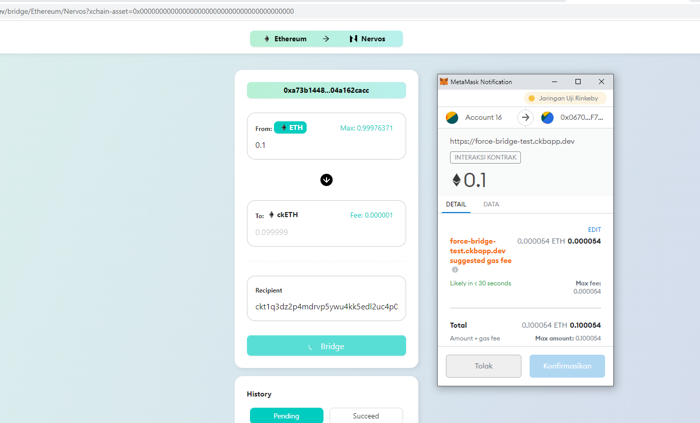
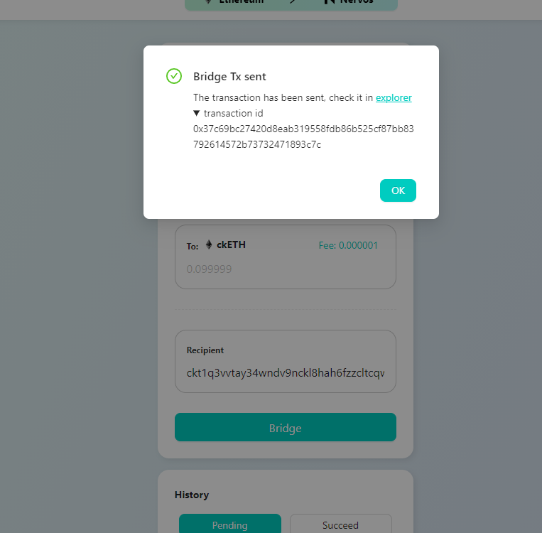

# Task 8

1. Web screenshots

#1 Sample app with bridge link


#2 Bridging


#3 Confirm Bridge transaction


2. Transaction ID

```
0x37c69bc27420d8eab319558fdb86b525cf87bb83792614572b73732471893c7c
```


3. Link to repo
https://github.com/WAHYU1236/gitcoin-/tree/main/7/DAP