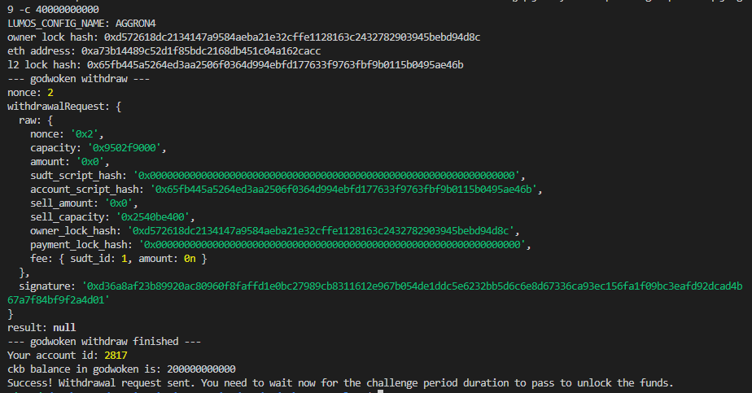

## 1. A screenshot of the console output immediately after running the withdraw command.

## 2. The Ethereum address that you've used for your Layer 2 account 
      0xa73b14489c52d1f85bdc2168db451c04a162cacc

## 3. The Nervos Layer 1 address that you passed to withdraw command 
ckt1qyq2jwr6vyhk65v9epzkct4tglclp45mwfmqcj5hg9

