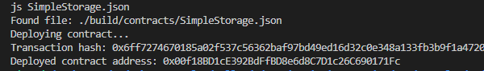

# 1. Screenshot of the console output immediately after you have successfully deployed a smart contract

# 2. Transaction hash from the contract deployment 
0x6ff7274670185a02f537c56362baf97bd49ed16d32c0e348a133fb3b9f1a4720

# 3. Deployed contract address from the contract deployment 

0x00f18BD1cE392BdFfBD8e6d8C7D1c26C690171Fc
