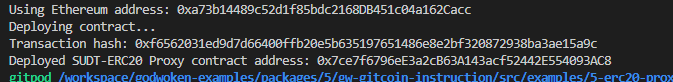
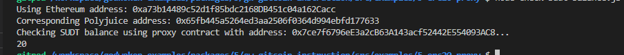

## Task 5 Deploy The ERC20 Proxy Contract For The Deposited SUDT

1.


2.The address of the ERC20 Proxy Contract you deployed .
```sh
0x7ce7f6796eE3a2cB63A143acf52442E554093AC8
```

3.A screenshot of the console output immediately after checking your SUDT balance.


4.The Ethereum address that was checked 
```sh
0xa73b14489c52d1f85bdc2168DB451c04a162Cacc
```