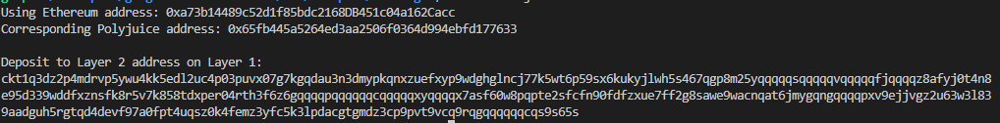

## Task 6 Use Force Bridge To Deposit Tokens From Ethereum To Polyjuice

1.A screenshot  Deposit Receiver Address.


2.Your Deposit Receiver Address 
```sh
ckt1q3dz2p4mdrvp5ywu4kk5edl2uc4p03puvx07g7kgqdau3n3dmypkqnxzuefxyp9wdghglncj77k5wt6p59sx6kukyjlwh5s467qgp8m25yqqqqqsqqqqqvqqqqqfjqqqqz8afyj0t4n8e95d339wddfxznsfk8r5v7k858tdxper04rth3f6z6gqqqqpqqqqqqcqqqqqxyqqqqx7asf60w8pqpte2sfcfn90fdfzxue7ff2g8sawe9wacnqat6jmygqngqqqqpxv9ejjvgz2u63w3l839aadguh5rgtqd4devf97a0fpt4uqsz0k4femz3yfc5k3lpdacgtgmdz3cp9pvt9vcq9rqgqqqqqqcqs9s65s

```

3.The Ethereum address used to generate the Deposit Receiver Address 
```sh
0xa73b14489c52d1f85bdc2168DB451c04a162Cacc
```

4.A link to the Etherscan explorer for the successful Force Bridge transaction. This can be found on Force Bridge under History→Succeed.
https://rinkeby.etherscan.io/tx/0xc879bdedda77cd107d079e801186d571bfbee470b05f4d6d0f83903bdda60962

5.A link to the Nervos explorer for the successful Force bridge transaction. This can be found on Force Bridge under History→Succeed.
https://explorer.nervos.org/aggron/address/ckt1q3vvtay34wndv9nckl8hah6fzzcltcqwcrx79apwp2a5lkd07fdx8femz3yfc5k3lpdacgtgmdz3cp9pvt9vc588g0j